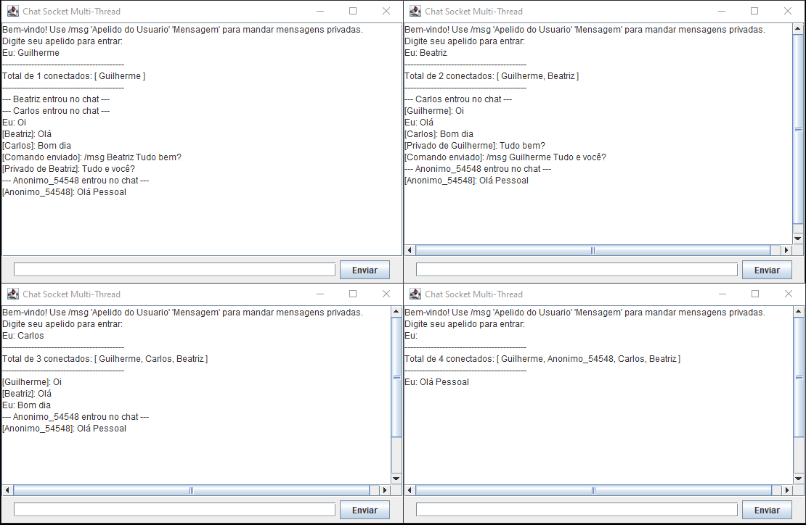

# 💬 Java Multi-Threaded Chat Server

> Uma aplicação de Chat Cliente-Servidor robusta, desenvolvida em Java, focada em performance e experiência do usuário com interface gráfica.

<div align="center">

  
  
  

</div>

---

## 📸 Screenshots

<div align="center">
  
</div>

---

## 🚀 Funcionalidades

O sistema foi projetado para ser escalável e seguro, implementando:

| Recurso | Descrição |
| :--- | :--- |
| 🌐 **Arquitetura** | Comunicação estável via **Sockets TCP/IP**. |
| ⚡ **Thread Pool** | Uso de `ExecutorService` para gerenciar até 50 conexões simultâneas sem travar o servidor. |
| 🖥️ **Interface Gráfica** | Cliente com **Java Swing**, eliminando a necessidade de terminal para o usuário final. |
| 📢 **Broadcast** | Mensagens enviadas são replicadas instantaneamente para todos na sala. |
| 🔒 **Privacidade** | Comando `/msg` para enviar mensagens privadas e sigilosas. |
| 🛡️ **Thread-Safety** | Blocos `synchronized` protegem a lista de usuários contra condições de corrida (*Race Conditions*). |

---

## 🛠️ Tecnologias Utilizadas

<div align="left">
  
  
  
  
</div>

---

## 📂 Estrutura do Projeto

```text
📁 src
├── ServidorChat.java          # Classe principal (Main) do servidor e Thread Pool
├── ClienteGUI.java            # Interface Gráfica (Swing) do cliente
├── AtendenteCliente.java      # Lógica (Runnable) de cada conexão no servidor
├── GerenciadorDeClientes.java # Controle de lista de usuários e roteamento de mensagens
└── OuvinteServidor.java       # Thread de escuta assíncrona do cliente
```

---

## ⚙️ Como Executar

### Pré-requisitos
Certifique-se de ter o [Java JDK](https://www.oracle.com/java/technologies/downloads/) instalado.

### 1. Compilar o Código
Abra o terminal na pasta do projeto e execute:
```bash
javac *.java
```

### 2. Iniciar o Servidor
Primeiro, inicie o servidor (ele ficará escutando na porta `12345`):
```bash
java ServidorChat
```
_Você verá a mensagem: "Aguardando conexoes na porta 12345..."_

### 3. Iniciar os Clientes
Abra novos terminais (quantos quiser) e execute:
```bash
java ClienteGUI
```
1. Uma janela abrirá pedindo o IP. Se for local, deixe `localhost`.
2. No chat, digite seu **Apelido** quando solicitado.

---

## 🎮 Comandos do Chat

| Ação | Comando / Sintaxe |
| :--- | :--- |
| **Chat Geral** | Apenas digite e envie. Todos verão. |
| **Mensagem Privada** | `/msg [Nome] [Mensagem]` <br> *Ex: `/msg Guilherme Olá, tudo bem?`* |
| **Sair** | Digite `sair` ou feche a janela. |

---

## 🧠 Destaques Técnicos

Este projeto explorou conceitos avançados de sistemas distribuídos:

* **Sockets & TCP Handshake:** Estabelecimento manual de conexão confiável entre processos distintos.
* **Multithreading vs Thread Pool:** Substituição da criação infinita de `new Thread()` pelo uso de `FixedThreadPool`, garantindo reutilização de recursos e protegendo o servidor contra sobrecarga de memória.
* **Sincronização (Monitores):** Uso estratégico de `synchronized` na classe `GerenciadorDeClientes` para evitar que múltiplas threads corrompam o Mapa de usuários conectados.
* **Event Dispatch Thread (EDT):** Separação correta entre a Thread de rede (que ouve mensagens) e a Thread do Swing (que desenha a tela), evitando que a interface congele.
