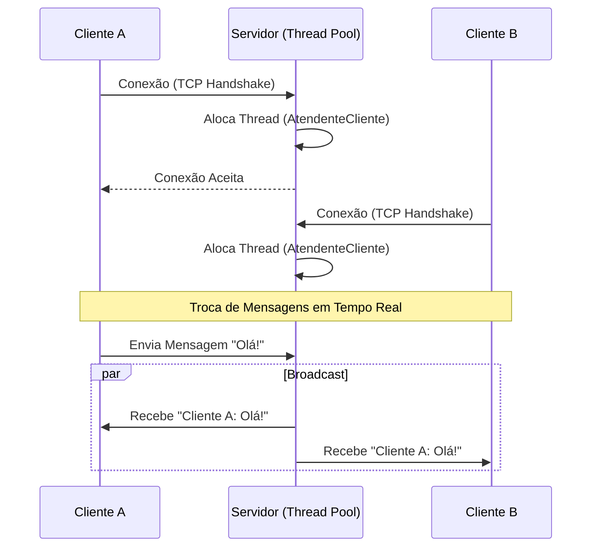

# Java Multi-Threaded Chat Server

> **Uma exploração prática de programação concorrente, sockets TCP e arquitetura de sistemas distribuídos.**

<div align="center">


</div>

---

## Sobre o Projeto

Este projeto é uma **implementação robusta de um sistema de Chat Cliente-Servidor**, desenvolvida para demonstrar o domínio sobre conceitos fundamentais de engenharia de software como **Multithreading**, **Sincronização de Threads**, **Gerenciamento de Recursos** e **UI/UX com Swing**.

O objetivo não é apenas criar um chat, mas sim construir uma arquitetura resiliente capaz de lidar com múltiplas conexões simultâneas sem bloqueios (non-blocking issues) ou condições de corrida (race conditions). Ideal para estudos de caso em **Sistemas Distribuídos** e **Redes de Computadores**.

---

## Screenshots

<div align="center">
  
</div>

---

## Funcionalidades

O sistema foi projetado para ser escalável e seguro, implementando:

| Recurso | Descrição |
| :--- | :--- |
| **Arquitetura** | Comunicação estável via **Sockets TCP/IP**. |
| **Thread Pool** | Uso de `ExecutorService` para gerenciar até 50 conexões simultâneas sem travar o servidor. |
| **Interface Gráfica** | Cliente com **Java Swing**, eliminando a necessidade de terminal para o usuário final. |
| **Broadcast** | Mensagens enviadas são replicadas instantaneamente para todos na sala. |
| **Privacidade** | Comando `/msg` para enviar mensagens privadas e sigilosas. |
| **Thread-Safety** | Blocos `synchronized` protegem a lista de usuários contra condições de corrida (*Race Conditions*). |

---
## Destaques Técnicos (Engineering Decisions)

Para recrutadores e desenvolvedores, aqui estão as decisões de design críticas tomadas neste projeto:

### 1. Robustez com `ExecutorService` (Thread Pool)
Ao invés de criar uma nova `Thread` para cada cliente (`new Thread(runnable).start()`), o que poderia levar a um erro de *OutOfMemoryError* sob alta carga, utilizei um **Cached Thread Pool** (ou Fixed dependendo da configuração).
*   **Por quê?** Reutilização de threads, controle do número máximo de conexões simultâneas e menor *overhead* de sistema operacional na criação/destruição de threads.

### 2. Thread-Safety em Estruturas de Dados
A lista de clientes conectados é um recurso compartilhado crítico.
*   **Solução:** Implementação de blocos `synchronized` na classe `GerenciadorDeClientes` para garantir que operações de adição/remoção de usuários sejam atômicas. Isso previne `ConcurrentModificationException` e estados inconsistentes.

### 3. Separação de Responsabilidades (EDT vs Network Thread)
No cliente Swing, a leitura de mensagens da rede bloqueia a execução (`in.readLine()`).
*   **Solução:** Uma Thread dedicada (`OuvinteServidor`) escuta o servidor, enquanto a **Event Dispatch Thread (EDT)** do Swing cuida apenas da atualização visual. Isso evita que a interface congele ("System not responding") durante a espera por mensagens.

---
## Arquitetura do Sistema

A comunicação é baseada no modelo **TCP/IP** para garantir a entrega de pacotes. O servidor atua como um *Hub* central, gerenciando o estado de todos os clientes conectados e realizando o *Broadcast* de mensagens.



---

---

## Tecnologias

*   **Linguagem:** Java (JDK 8+)
*   **Interface:** Java Swing (JFrame, JPanel, JScrollPane)
*   **Rede:** `java.net.Socket`, `java.net.ServerSocket`
*   **IO:** `java.io.PrintWriter`, `java.io.BufferedReader`
*   **Concorrência:** `java.util.concurrent.ExecutorService`, `synchronized`

---

##  Estrutura do Projeto

```text
src
├── ServidorChat.java          # Classe principal (Main) do servidor e Thread Pool
├── ClienteGUI.java            # Interface Gráfica (Swing) do cliente
├── AtendenteCliente.java      # Lógica (Runnable) de cada conexão no servidor
├── GerenciadorDeClientes.java # Controle de lista de usuários e roteamento de mensagens
└── OuvinteServidor.java       # Thread de escuta assíncrona do cliente
```

---

## Como Executar

### Pré-requisitos
Certifique-se de ter o [Java JDK](https://www.oracle.com/java/technologies/downloads/) instalado.

### 1. Compilar o Código
Abra o terminal na pasta do projeto e execute:
```bash
javac *.java
```

### 2. Iniciar o Servidor
Primeiro, inicie o servidor (ele ficará escutando na porta `12345`):
```bash
java ServidorChat
```
_Você verá a mensagem: "Aguardando conexoes na porta 12345..."_

### 3. Iniciar os Clientes
Abra novos terminais (quantos quiser) e execute:
```bash
java ClienteGUI
```
1. Uma janela abrirá pedindo o IP. Se for local, deixe `localhost`.
2. No chat, digite seu **Apelido** quando solicitado.

---

## Comandos do Chat

| Ação | Comando / Sintaxe |
| :--- | :--- |
| **Chat Geral** | Apenas digite e envie. Todos verão. |
| **Mensagem Privada** | `/msg [Nome] [Mensagem]` <br> *Ex: `/msg Guilherme Olá, tudo bem?`* |
| **Sair** | Digite `sair` ou feche a janela. |

